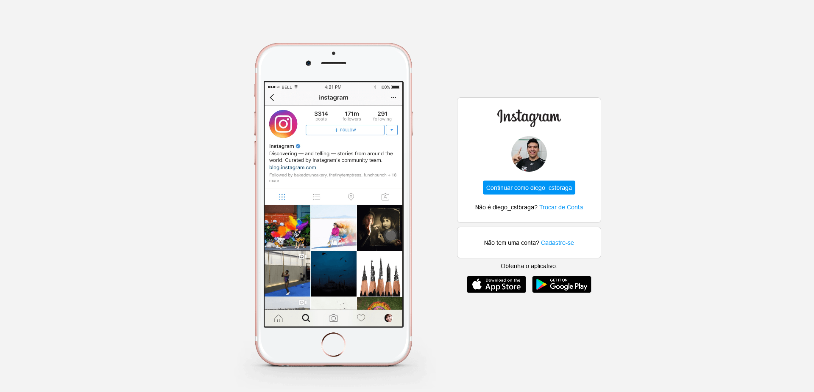

# Instagram Clone UI

## Tela inicial do Projeto

## 🧪 Tecnologias
Esse projeto foi desenvolvido com as seguintes tecnologias:
- [HTML](https://developer.mozilla.org/pt-BR/docs/Web/HTML)
- [CSS](https://developer.mozilla.org/pt-BR/docs/Web/HTML)

## 💻 Projeto
Recriar interface da tela inicial de login do Instagram para aprimorar conceitos de HTML, CSS, flexbox e responsividade
